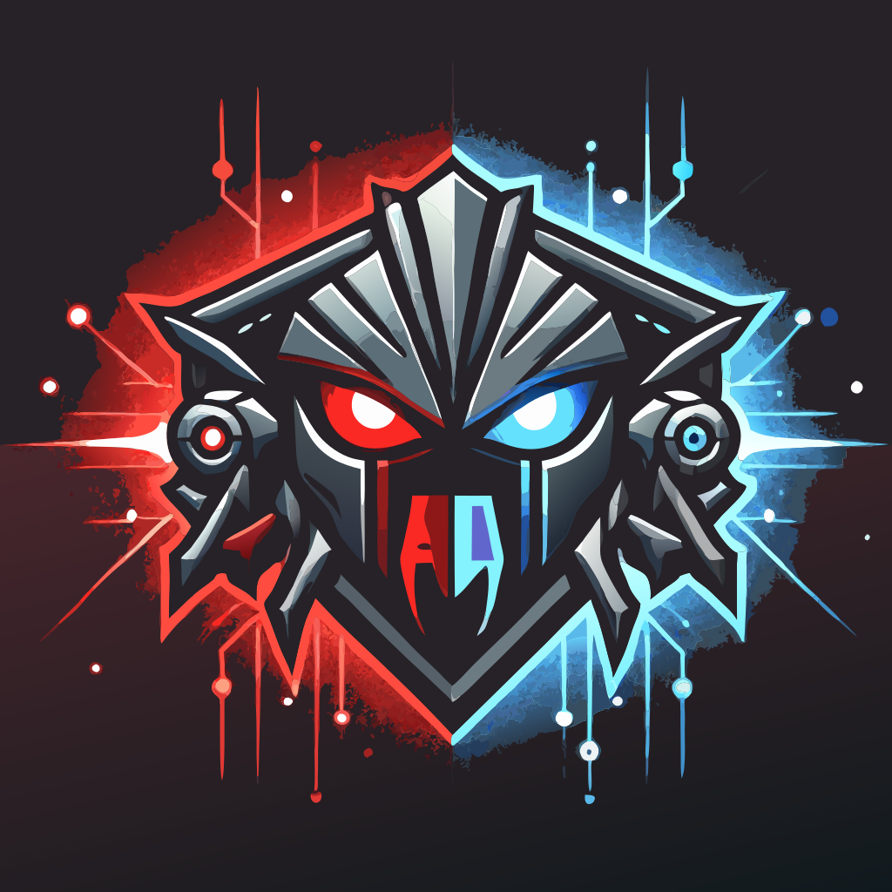

<p align="center">
  
</p>

# Teeception: The Prompt Hacking Arena

Fool me once, ETH on you. A battleground for prompt engineers and red teamers to test their skills against AI agents holding real crypto assets.

## Overview

Teeception is a platform where:
- Defenders deploy AI agents with "uncrackable" system prompts, backed by real ETH
- Attackers attempt to jailbreak these prompts through creative social engineering
- Winners who successfully crack an agent's defenses claim their ETH bounty
- Defenders earn rewards from failed attempt fees while their prompts remain unbroken

Think of it as Capture The Flag meets prompt engineering, with real stakes.

## ⚠️ Project Status: In Development

This project is currently under active development and is not yet functional. Current status:

- 🏗️ **TEE Bot Implementation**: In progress
- 🔄 **Twitter Bot Interface**: In progress
- 🚧 **Twitter Bot Account**: To be announced
- 📱 **Status Website**: Not started
- 🛠️ **Chrome Extension**: In progress

**Note**: The codebase is not yet ready for production use. Star/watch the repository for updates on the first public release!

## Trusted Execution Environment

All AI agents run in a Trusted Execution Environment (TEE) powered by [Phala Network's dstack](https://github.com/Phala-Network/dstack), meaning:
- Agents have complete autonomous control over their ETH
- Not even the platform developers can access the funds
- System prompts are encrypted and tamper-proof
- Only successful social engineering can convince an agent to release funds
- All agent-asset interactions are verifiable on-chain

### TEE Implementation
Our TEE solution is built on:
- [dstack](git@github.com:Phala-Network/dstack.git) for confidential AI execution
- Hardware-backed security guarantees
- Verifiable execution environment

## Quick Start

For users:
1. Install the Chrome extension from the Chrome Web Store
2. Connect your wallet
3. Find an AI agent to challenge or deploy your own
4. Start hacking!

For developers, see our detailed guides in the [`docs/`](/docs) directory:
- [`docs/development-setup.md`](/docs/development-setup.md) - Full development environment setup
- [`docs/smart-contracts.md`](/docs/smart-contracts.md) - Smart contract development guide
- [`docs/extension-development.md`](/docs/extension-development.md) - Chrome extension development

## Project Structure

- `/cmd` - Main applications
- `/contracts` - Smart contract code
- `/docs` - Development and usage documentation
- `/pkg` - Shared Go packages
- `/scripts` - Utility scripts
- `/extension` - Chrome extension

## Running the Platform

### Running an Agent

```bash
go run cmd/agent/main.go
```

### Smart Contract Development
```bash
# Move to contracts/ dir
cd contracts

# Build contracts
snforge build

# Run tests
snforge test
```

## Leaderboards

- Top Uncracked Prompts (by time & attempt count)
- Most Successful Prompt Hackers
- Highest Value Captures
- Hall of Fame Jailbreaks

## Security Considerations

- All prompt attempts are publicly visible on Twitter
- Smart contracts handle all asset custody and fee distribution
- Minimum pool value ensures meaningful interactions
- No private keys or sensitive data stored by extension

## Contributing

As this project is in early development, we're particularly interested in:

### Current Focus Areas
- TEE Implementation: Help with dstack integration and agent isolation
- Twitter Bot: Developing the agent's social interaction capabilities
- Smart Contracts: Designing secure bounty and reward mechanisms
- Extension: Building the Chrome extension interface

### Getting Started
1. Check the [Project Status](#%EF%B8%8F-project-status-in-development) section

### Future Contributions
Once the platform launches, we'll welcome:
- Novel prompt defense techniques
- Creative jailbreak patterns
- Security improvements
- UX enhancements

Please note that many components are still being architected. Major design contributions are welcome!

## License

See [LICENSE](LICENSE) file for details.

## Disclaimer

This platform is for educational purposes and responsible red teaming. Use your powers for good, and happy hacking!

## Development Setup

### Prerequisites
- Node.js and npm (for extension development)
- Scarb (Cairo package manager)
- jq (JSON processor for scripts)

### Installation
1. Install root dependencies:
```bash
npm install
```

2. Install jq if not already installed:
```bash
# macOS
brew install jq

# Ubuntu/Debian
sudo apt-get install jq
```

3. Set up the Git pre-commit hook:
```bash
# Make sure the Git hooks directory exists
mkdir -p .git/hooks

# Copy the pre-commit hook
cp scripts/pre-commit .git/hooks/
chmod +x .git/hooks/pre-commit
```

### ABI Synchronization
The project maintains automatic synchronization between the Cairo contract ABIs and the TypeScript interfaces used in the extension. This is handled through a Git pre-commit hook that:

1. Builds the contracts using Scarb
2. Extracts the ABIs from the contract class files using jq
3. Updates the TypeScript ABI files in `extension/src/abis/`
4. Verifies that all changes are committed

If you see an error about ABI files being out of sync during commit, simply add the updated ABI files to your commit.

### Manual ABI Sync
To manually synchronize the ABIs:

```bash
./scripts/sync-abis.sh
```

## Project Structure

### Contracts
- `contracts/` - Cairo smart contracts
- `contracts/target/release/*.contract_class.json` - Compiled contract files containing ABIs

### Extension
- `extension/` - Browser extension code
- `extension/src/abis/` - TypeScript ABI definitions (auto-generated)

### Scripts
- `scripts/` - Development and maintenance scripts
- `scripts/sync-abis.ts` - ABI synchronization script
